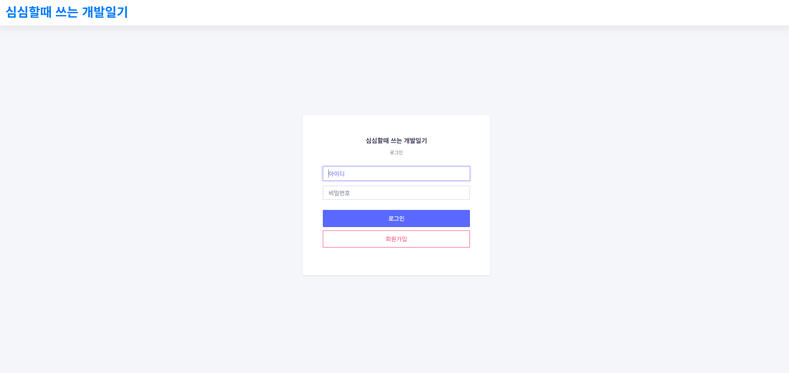
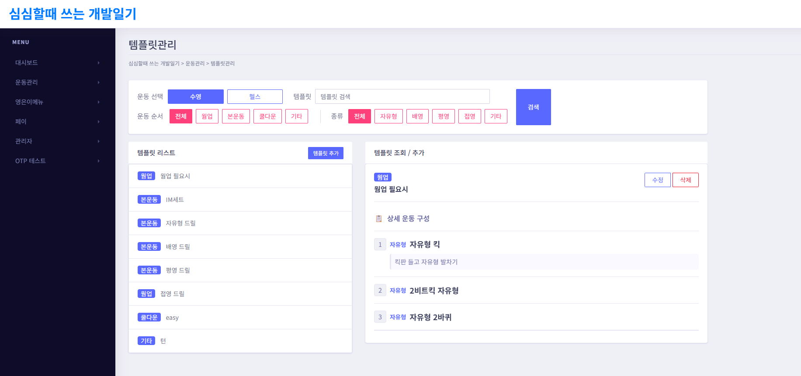
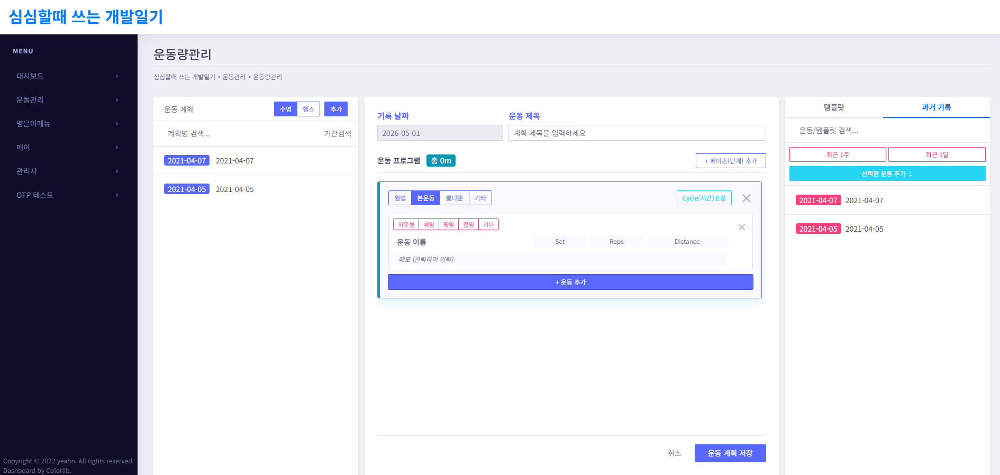
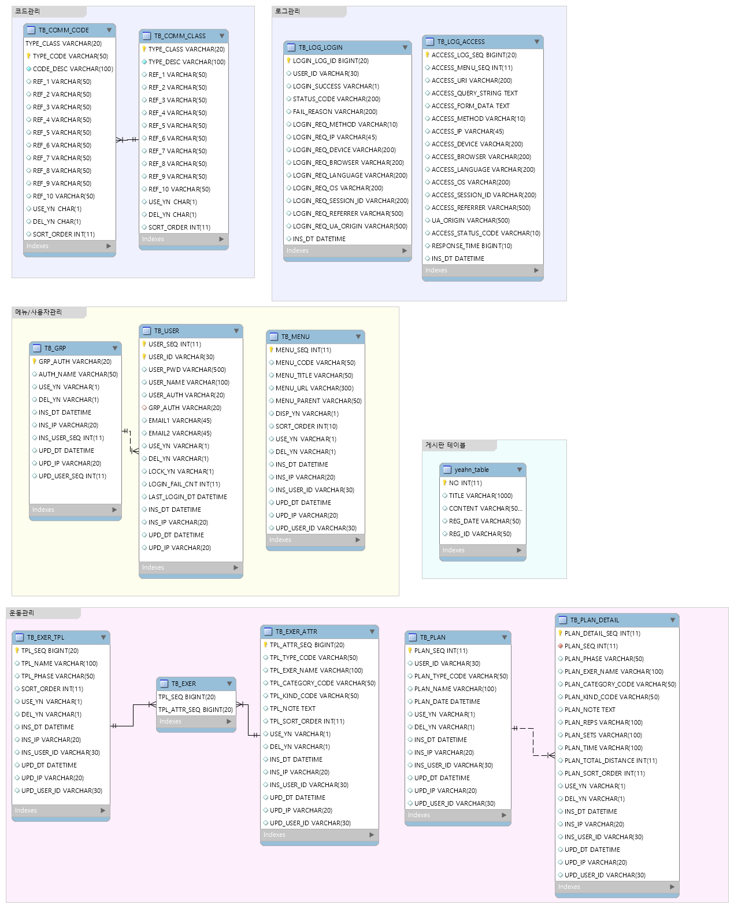

# 운동 기록 관리 시스템

Spring Boot 기반의 개인 운동 계획 및 기록 관리 웹 애플리케이션입니다.

## 화면 구성

| 로그인 | 운동 템플릿 | 운동 계획 |
|---|---|---|
|  |  |  |

## ERD



## 기술 스택

| 분류 | 기술 |
|---|---|
| Backend | Java 8, Spring Boot 2.6.11, Spring Security, MyBatis |
| Database | MariaDB, Caffeine Cache |
| Frontend | Mustache, jQuery, Bootstrap 4 |
| Infra | GitHub Actions CI/CD, Cloudtype (PaaS) |
| Storage | IBM Cloud Object Storage (S3 호환) |

## 주요 기능

### 운동 계획 관리
- 헬스(GYM) / 수영(SWIM) 유형별 운동 계획 작성
- 웜업 / 본운동 / 쿨다운 등 페이즈(단계) 구분 기록
- 운동별 Set, Reps, Time/Distance, 메모 입력
- 수영 모드: Cycle 포함 여부 전환 및 총 거리 자동 합산
- 템플릿 라이브러리 / 과거 기록에서 운동 항목 선택하여 바로 추가
- 계획명, 날짜 범위 검색 및 퀵 필터(최근 1주 / 1달)

### 운동 템플릿 관리
- 자주 쓰는 운동 세트를 템플릿으로 저장 및 재사용

### 보안 / 인증
- Spring Security 폼 로그인, BCrypt 비밀번호 암호화
- 커스텀 로그인 성공/실패 핸들러

### 운영 기능
- `AccessLogFilter` — 모든 HTTP 요청(URI, IP, User-Agent, 응답시간)을 DB에 자동 기록
- 로그인 이력 기록
- 메뉴 목록 Caffeine 캐시 적용 (TTL 1시간)
- IBM COS 파일 업로드
- 공통 코드 테이블 기반 코드-설명 변환 (`FN_GET_COMM_CODE_DESC` DB 함수)
- 엑셀 다운로드

## 아키텍처

```
HTTP 요청
  └─ AccessLogFilter (OncePerRequestFilter) — 요청 로깅
       └─ Spring Security — 인증/인가
            └─ Controller → Service → MyBatis Mapper → MariaDB
  
WebInterceptor (postHandle) — 모든 View에 MenuList 자동 주입
```

## 프로젝트 구조

```
src/main/java/com/yeahn/
├── security/       # SecurityConfig, AccessLogFilter, 로그인 핸들러
├── auth/           # 로그인, 회원가입, UserDetailsService
├── plan/           # 운동 계획 관리
├── template/       # 운동 템플릿 관리
├── menu/           # 메뉴 CRUD + Caffeine 캐시
├── log/            # Access 로그, 로그인 이력
├── otp/            # TOTP OTP 테스트
├── common/         # S3Uploader, ExcelUtils, 공통 코드
└── yetable/        # 범용 데이터 테이블 + 엑셀 다운로드
```

## 테스트

통합 테스트는 실제 MariaDB에 연결합니다.                                                                                                                                          
로컬 실행 시 `application-test.properties`의 DB, CI에서는 Docker로 띄운 MariaDB를 사용합니다.

## CI/CD

`master` 브랜치 push / PR 시 GitHub Actions가 자동 실행됩니다.

1. MariaDB 서비스 시작 및 스키마 적용
2. `mvn package -DskipTests` 빌드
3. `mvn test` 통합 테스트
4. `master` 머지 시 Cloudtype에 자동 배포

## 환경 설정

| 프로파일 | 용도 |
|---|---|
| (기본) | 로컬 개발 (`application.properties`) |
| `test` | CI 및 통합 테스트 (`application-test.properties`, 환경변수로 민감정보 주입) |
| `prod` | 운영 배포 (Cloudtype 환경변수) |

## 개발 도구

개발 생산성 향상을 위해 Claude Code(AI 코딩 어시스턴트)를 활용했습니다.

- CI/CD 워크플로우 설계 및 GitHub Actions 작성
- 통합 테스트 코드 작성
- 코드 리뷰 및 리팩토링 보조
- springboot-expert, mybatis-expert 등 전문 서브에이전트를 도메인별로 분리하여 활용
